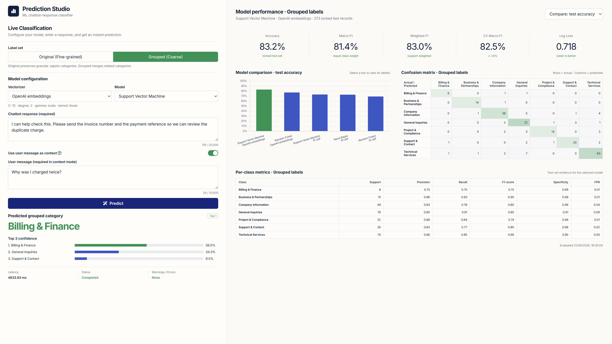

<div align="center">

# Japeto Prediction Studio

**A reproducible machine-learning pipeline and local analytics dashboard for classifying chatbot responses.**

[Quick start](#quick-start) · [Pipeline](#reproducible-pipeline) · [Model catalogue](#model-catalogue) · [API](#api-reference) · [Project structure](#project-structure)

</div>

<p align="center">
  
</p>

## Overview

Chatbot conversations contain valuable signals about what users need, but reviewing and categorizing every response manually is slow, inconsistent, and difficult to scale. Japeto Prediction Studio automates that work by using machine-learning models to classify chatbot responses into meaningful business categories.

The project provides a complete environment for preparing conversational data, training and comparing classification models, evaluating their reliability, and making predictions through a web interface or REST API. It supports both detailed topic labels and broader grouped categories, making it useful for tasks such as conversation analysis, support routing, trend discovery, and service-quality monitoring.

Models can classify a chatbot response on its own or use the preceding user message as additional context. The application compares several algorithms and feature strategies, presents their performance transparently, and lets users choose the model best suited to their needs.

The browser dashboard lets you:

- classify chatbot responses with any registered model;
- compare model accuracy, macro F1, weighted F1, cross-validation performance, and log loss;
- inspect confusion matrices and per-class metrics;
- switch between original and grouped labels;
- classify a response by itself or together with its user-message context.

## Quick start

### Requirements

- Python 3.10 or newer
- An OpenAI API key only when generating embeddings or using an OpenAI-backed model

### 1. Create the environment

PowerShell:

```powershell
python -m venv .venv
.venv\Scripts\Activate.ps1
python -m pip install --upgrade pip
pip install -e ".[dev]"
Copy-Item .env.example .env
```

macOS or Linux:

```bash
python3 -m venv .venv
source .venv/bin/activate
python -m pip install --upgrade pip
pip install -e ".[dev]"
cp .env.example .env
```

### 2. Prepare and start the application

For a fast local setup using TF-IDF models only (when no embedding artifacts already exist):

```bash
python -m japeto_classifier bootstrap --quick
```

For the complete catalogue, add `OPENAI_API_KEY` to `.env`, then run:

```bash
python -m japeto_classifier bootstrap --with-openai
```

Open **[http://localhost:8000](http://localhost:8000)** in your browser. The application binds to `localhost` on port `8000` by default.

Once the data and model artifacts exist, subsequent starts only need:

```bash
python -m japeto_classifier serve
```

The installed console command is equivalent:

```bash
japeto-classifier serve
```

## Reproducible pipeline

Run each stage explicitly when you want full control over preparation and training:

```bash
# 1. Validate and normalize the source workbook
python -m japeto_classifier ingest

# 2. Create deterministic, group-aware train/calibration/test splits
python -m japeto_classifier split

# 3. Generate resumable OpenAI embeddings for both input modes
python -m japeto_classifier embed --mode all

# 4. Train, calibrate, evaluate, and register all compatible models
python -m japeto_classifier train --features all

# 5. Print the model registry and evaluation summary
python -m japeto_classifier evaluate

# 6. Start the dashboard and API
python -m japeto_classifier serve
```

### Useful command options

| Command | Option | Purpose |
| --- | --- | --- |
| `ingest` | `--source PATH` | Read a workbook other than the configured default. |
| `ingest` | `--schema-only` | Inspect workbook structure without ingesting it. |
| `embed` | `--mode response_only` | Generate embeddings from chatbot responses only. |
| `embed` | `--mode context_enhanced` | Include the associated user message in each embedding. |
| `embed` | `--batch-size N` | Set the OpenAI embedding batch size; the default is `64`. |
| `embed` | `--force` | Regenerate embeddings even when current artifacts exist. |
| `train` | `--features tfidf` | Train only local TF-IDF models; no API key is required. |
| `train` | `--features openai` | Train only models that use generated OpenAI embeddings. |
| `train` | `--quick` | Use one parameter choice per algorithm for a faster run. |
| `train` | `--only MODEL_ID ...` | Train only the named model IDs. |
| `bootstrap` | `--no-serve` | Prepare and train without starting the web server. |
| `serve` | `--reload` | Restart the server when source files change. |
| `serve` / `bootstrap` | `--host HOST --port PORT` | Override the default `localhost:8000` address. |

To see every available option:

```bash
python -m japeto_classifier --help
python -m japeto_classifier <command> --help
```

## Model catalogue

The complete catalogue contains **20 compatible configurations** assembled from:

| Dimension | Choices |
| --- | --- |
| Input | `response_only`, `context_enhanced` |
| Labels | 20 original categories, 7 grouped categories |
| Features | TF-IDF, OpenAI `text-embedding-3-small` embeddings |
| Algorithms | Support Vector Machine, Random Forest, Multinomial Naive Bayes |

Multinomial Naive Bayes is used only with non-negative TF-IDF features, so OpenAI feature configurations use SVM or Random Forest. Model IDs follow this pattern:

```text
<algorithm>__<feature_type>__<label_scheme>__<input_mode>
```

For example:

```text
svm__tfidf__grouped__response_only
random_forest__openai__original__context_enhanced
```

## Evaluation policy

- The chatbot response is always the primary classification input.
- `response_only` uses the response alone; `context_enhanced` also includes the associated user message.
- Every model uses deterministic partitions created with random state `42`.
- A complete `session_id` remains in one partition to prevent conversation leakage.
- TF-IDF vocabulary fitting and hyperparameter search occur only within training folds.
- Calibration and test records remain isolated from model selection.
- The locked test set is evaluated once, with reproducibility and integrity prioritized over reproducing a legacy headline score.

The original notebook remains in `notebooks/` as research evidence. The application does not import or execute it.

## API reference

FastAPI exposes the dashboard and prediction API from the same server:

| Method | Endpoint | Description |
| --- | --- | --- |
| `GET` | `/` | Open the dashboard. |
| `GET` | `/health` | Check readiness, registered models, data artifacts, and OpenAI configuration. |
| `GET` | `/api/models` | List registered models and their summary metrics. |
| `GET` | `/api/models/{model_id}` | Get one model's metadata and evaluation results. |
| `POST` | `/api/predict` | Classify a chatbot response with a registered model. |
| `GET` | `/docs` | Open the interactive Swagger API documentation. |

Example prediction request:

```bash
curl -X POST http://localhost:8000/api/predict \
  -H "Content-Type: application/json" \
  -d '{
    "model_id": "svm__tfidf__grouped__response_only",
    "chatbot_response": "You can contact our support team through the help centre."
  }'
```

Context-enhanced models also require the `user_message` field. OpenAI-backed models require a valid `OPENAI_API_KEY` at prediction time.

## Configuration

Copy `.env.example` to `.env` and adjust values as needed:

| Variable | Required | Default | Description |
| --- | --- | --- | --- |
| `OPENAI_API_KEY` | Only for OpenAI features | — | Generates embeddings and serves OpenAI-backed predictions. |
| `JAPETO_DATA_DIR` | No | `data` | Processed records, split assignments, and embedding artifacts. |
| `JAPETO_ARTIFACTS_DIR` | No | `artifacts` | Trained models, metrics, and the model registry. |
| `JAPETO_DASHBOARD_PATH` | No | `app/dashboard.html` | HTML file served at the root URL. |

Never commit `.env` or place an API key in source code, notebooks, or reports.

## Project structure

```text
classifier/
├── app/
│   └── dashboard.html          # Single-page dashboard
├── artifacts/
│   ├── metrics/                # Per-model evaluation reports
│   ├── models/                 # Serialized fitted pipelines
│   └── registry.json           # Model catalogue
├── data/
│   ├── embeddings/             # Generated embedding matrices
│   └── processed/              # Normalized records and split assignments
├── notebooks/                  # Legacy research and optional analysis
├── src/japeto_classifier/      # API, CLI, data, feature, and training code
├── dashboard.png               # Dashboard preview used in this README
├── dataset.xlsx                # Source workbook
├── pyproject.toml              # Package metadata and dependencies
└── README.md
```

Generated data and model files carry manifests for provenance and reproducibility. They can be rebuilt from the source workbook through the commands above.

## Development

Install the development dependencies, run the test suite, and start a reload-enabled server:

```bash
pip install -e ".[dev]"
pytest
python -m japeto_classifier serve --reload
```
